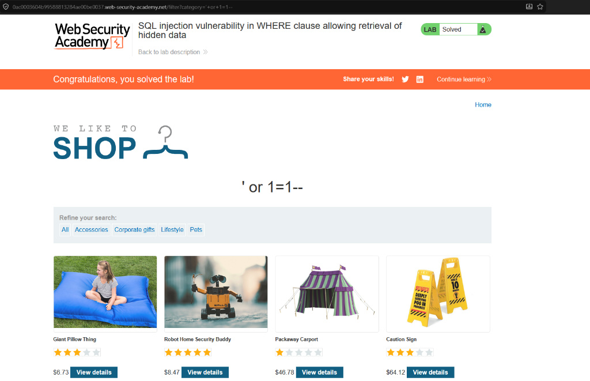

# Lab 1: SQL Injection Vulnerability in WHERE Clause Allowing Retrieval of Hidden Data

**Source:** PortSwigger Web Security Academy
**Status:** ✅ Solved

## Vulnerability

The product category filter builds a SQL `WHERE` clause directly from user
input without sanitization. This makes it possible to alter the logic of
the query and pull back rows that shouldn't normally be visible (e.g.
unreleased or hidden products).

## Steps

1. Identified the filter parameter in the URL:
   ```
   /filter?category=Gifts
   ```
2. The app likely runs a query similar to:
   ```sql
   SELECT * FROM products WHERE category = 'Gifts' AND released = 1
   ```
3. Injected a payload that always evaluates to `TRUE`, breaking out of the
   intended condition:
   ```
   ' or 1=1--
   ```
4. Full request:
   ```
   /filter?category=' or 1=1--
   ```

## Result

The `--` comments out the rest of the original query (including the
`released = 1` check), so the condition collapses to `category = '' OR 1=1`,
which is always true. This returned **every product**, including hidden/unreleased
ones, confirming the injection.



## Key Takeaway

- Single quote (`'`) breaks out of the string literal.
- `OR 1=1` forces the WHERE clause to always be true.
- `--` (with a trailing space) comments out the rest of the query so any
  remaining SQL (like an `AND` condition) is ignored.
- This is the most basic proof-of-concept for SQLi: it doesn't extract data
  yet, but it proves the input is unsanitized and reaches the query.
