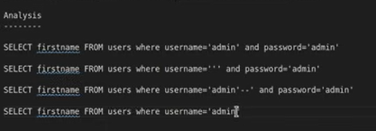
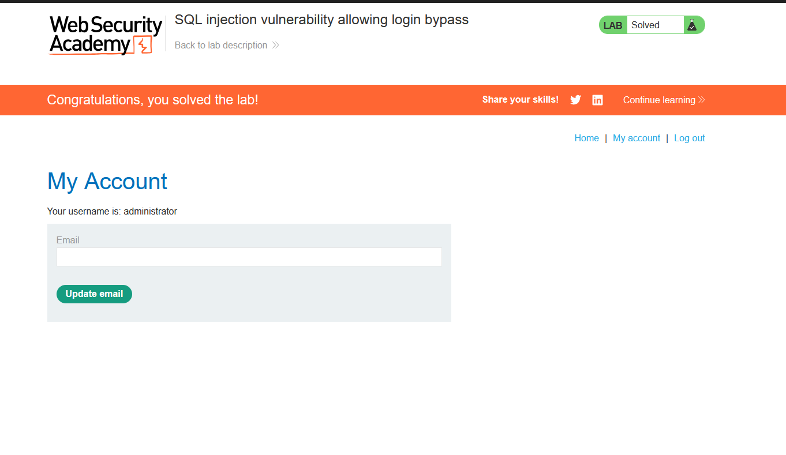

# Lab 2: SQL Injection Vulnerability Allowing Login Bypass

**Source:** PortSwigger Web Security Academy
**Status:** ✅ Solved

## Vulnerability

The login form's backend query concatenates the submitted username and
password directly into a SQL statement, without parameterization:

```sql
SELECT firstname FROM users WHERE username='<input>' AND password='<input>'
```

## Analysis

I worked through the query logic step by step to understand why the
injection works (see `analysis.png`):

| Username submitted | Resulting query | Outcome |
|---|---|---|
| `admin` | `... WHERE username='admin' AND password='admin'` | Fails unless password is correct |
| `''` | `... WHERE username='' and password='admin'` | Fails, no match |
| `admin'--` | `... WHERE username='admin'--' and password='admin'` | The `--` comments out the password check entirely |
| `admin` (final test) | `... WHERE username='admin` | Confirms the injection point |



## Payload

```
Username: administrator'--
Password: (anything)
```

By commenting out the `AND password=...` portion of the query with `--`,
the query reduces to just `WHERE username='administrator'`, which matches
the row regardless of what password was submitted.

## Result

Logged in as `administrator` without knowing the real password. Confirmed
on the "My Account" page showing **Your username is: administrator**.



## Key Takeaway

- SQL comments (`--`) are a simple but powerful way to bypass trailing
  conditions in a vulnerable query.
- Authentication logic must never be built by string-concatenating
  untrusted input — parameterized queries / prepared statements prevent
  this entire class of bug.
