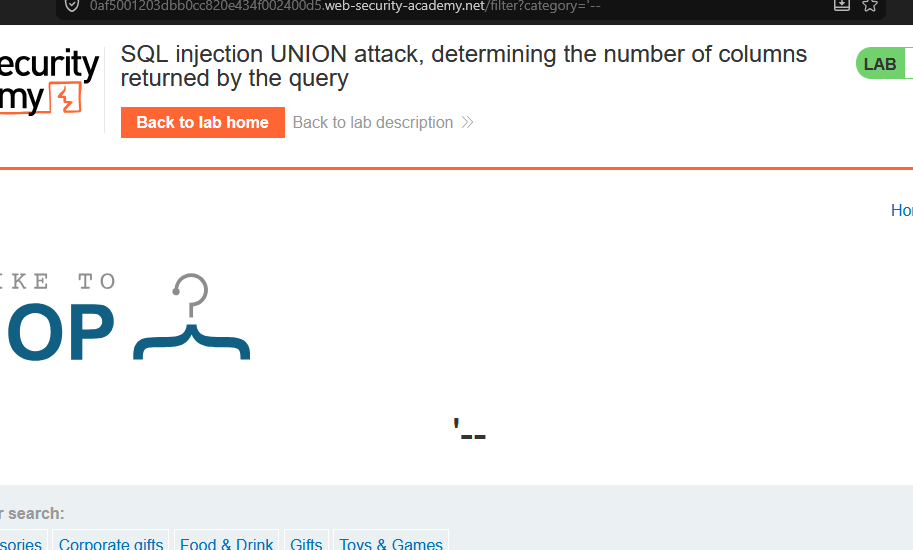
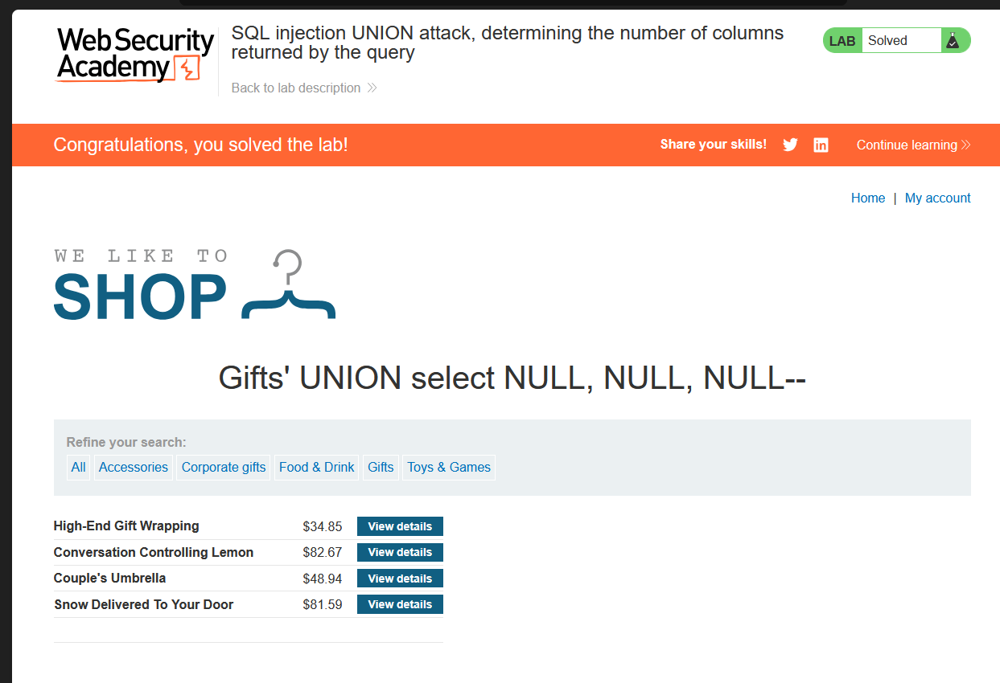

# Lab 3: SQL Injection UNION Attack — Determining the Number of Columns Returned by the Query

**Source:** PortSwigger Web Security Academy
**Status:** ✅ Solved

## Background

`UNION` lets you concatenate the results of two separate `SELECT`
statements into a single result set. To use it in an injection, two
conditions must be met:

1. Both queries must return the **same number of columns**.
2. The columns must have **compatible data types** in the same order.

`ORDER BY` can be used to sort (and, during recon, to probe) the number
of columns a query returns.

## Vulnerable endpoint

```
/product?productId=2
```
(category filter also injectable via `/filter?category=`)

## Step 1 — Find the column count

Tried incrementing `NULL` columns in a `UNION SELECT` until the query
stopped erroring out:

```
/filter?category=' UNION SELECT NULL--
/filter?category=' UNION SELECT NULL,NULL--
/filter?category=' UNION SELECT NULL,NULL,NULL--
```

`NULL` is used because it's valid for (almost) any column type, so it
sidesteps data-type mismatches while the column *count* is still unknown.

Three `NULL`s returned a valid page with no error, confirming the
original query returns **3 columns**.



## Step 2 — Identify which columns accept string data

Since the page needs somewhere to display a value, each `NULL` was
swapped one at a time for a string to see which column(s) render on the
page:

```
' UNION SELECT 'a',NULL,NULL,NULL--
' UNION SELECT NULL,'a',NULL,NULL--
' UNION SELECT NULL,NULL,'a',NULL--
' UNION SELECT NULL,NULL,NULL,'a'--
```

Whichever payload displayed `a` on the page marks a column that:
- accepts string/varchar data, and
- is reflected back in the visible response

— which is exactly where later data extraction (usernames, passwords,
table names, etc.) needs to be placed.

## Working payload

```
Gifts' UNION select NULL, NULL, NULL--
```



## Result

Lab solved — confirmed the query returns 3 columns and identified a
column that reflects string output back to the page.


## Key Takeaway

- Column-count discovery is the first mandatory step before any UNION
  based extraction.
- `ORDER BY N--` (incrementing N) is a faster alternative to guessing
  `NULL` columns one by one — it errors out once N exceeds the actual
  column count.
- Once you know which reflected column accepts strings, that's your
  target column for pulling out real data in later stages (versions,
  table names, credentials, etc.).
